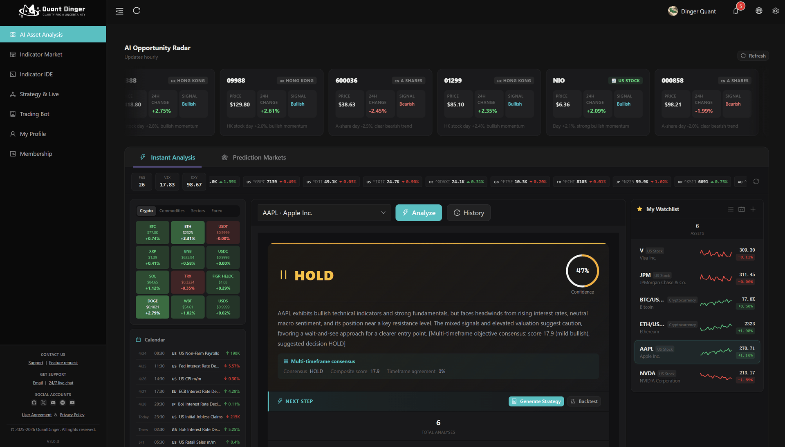
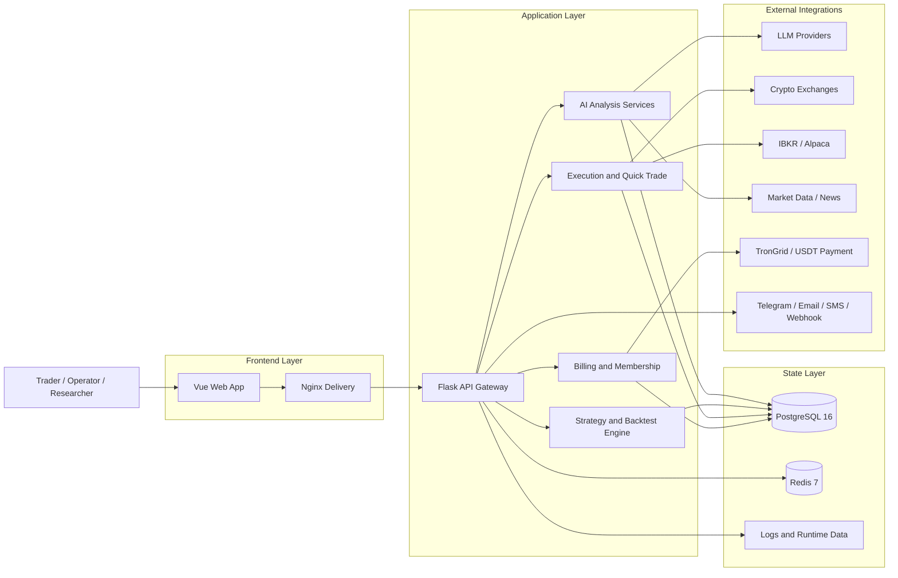

<div align="center">
  <a href="https://github.com/brokermr810/QuantDinger">
    
  </a>

  <h1>QuantDinger</h1>
  <h3>The open-source AI infrastructure layer for quant trading</h3>
  <p><strong>Turn trading ideas into Python strategies, backtests, paper trading, and live execution - all in one self-hosted stack.</strong></p>
  <p><strong>QuantDinger is a product of Open Byte Inc.</strong></p>
  <p><em>AI research -> Strategy code -> Backtest -> Paper/Live execution -> Monitoring</em></p>

  <div align="center" style="max-width: 680px; margin: 1.25rem auto 0; padding: 20px 22px 22px; border: 1px solid #d1d9e0; border-radius: 16px;">
    <p style="margin: 0 0 14px; line-height: 1.65;">
      <a href="README.md"><strong>English</strong></a>
      <span style="color: #afb8c1;"> / </span>
      <a href="docs/README_CN.md"><strong>Chinese</strong></a>
    </p>
    <p style="margin: 0 0 18px; padding-bottom: 16px; border-bottom: 1px solid #eaeef2; line-height: 2;">
      <a href="https://ai.quantdinger.com"><strong>SaaS</strong></a>
      <span style="color: #d8dee4;"> &nbsp;·&nbsp; </span>
      <a href="docs/api/README.md"><strong>API Docs</strong></a>
      <span style="color: #d8dee4;"> &nbsp;·&nbsp; </span>
      <a href="https://www.youtube.com/watch?v=tNAZ9uMiUUw"><strong>Video Demo</strong></a>
      <span style="color: #d8dee4;"> &nbsp;·&nbsp; </span>
      <a href="https://www.quantdinger.com"><strong>Website</strong></a>
    </p>
    <p style="margin: 0; line-height: 2;">
      <a href="https://t.me/quantdinger"></a>
      &nbsp;
      <a href="https://discord.com/invite/tyx5B6TChr"></a>
      &nbsp;
      <a href="https://youtube.com/@quantdinger"></a>
      &nbsp;
      <a href="https://x.com/QuantDinger_EN"></a>
    </p>
  </div>

  <p style="margin-top: 1.45rem; margin-bottom: 10px;">
    <a href="LICENSE"></a>
    
    
    
    
    
    
    
    
  </p>
</div>

---

## Contents

[Try in 2 minutes](#try-in-2-minutes) · [Why QuantDinger](#why-quantdinger) · [Safety model](#safety-model) · [Technical highlights](#technical-highlights) · [Repositories](#related-repositories) · [AI agents & MCP](#use-it-from-an-ai-agent-cursor--claude-code--codex--mcp) · [Overview](#product-overview) · [Features](#features-at-a-glance) · [Architecture](#architecture) · [Install](#installation--first-time-setup-docker-compose) · [Docs](#documentation) · [FAQ](#faq) · [License](#license-and-commercial-terms)

---

## Try in 2 minutes

> **Fastest path: one command.** No `git clone`, no `npm`, no Vue source tree. The installer asks for the admin account, writes secure secrets, pulls GHCR images, and starts Docker Compose.

**Prerequisites:** [Docker](https://docs.docker.com/get-docker/) with Compose v2 (Docker Desktop on Windows/macOS). **Node.js is not required.**

```bash
curl -fsSL https://raw.githubusercontent.com/brokermr810/QuantDinger/main/install.sh | bash
```

Windows PowerShell:

```powershell
irm https://raw.githubusercontent.com/brokermr810/QuantDinger/main/install.ps1 | iex
```

Installs to `~/quantdinger` on Linux/macOS and `$HOME\quantdinger` on Windows by default. Override with `... | bash -s -- /opt/quantdinger` or `$env:QUANTDINGER_INSTALL_DIR="C:\QuantDinger"` before the PowerShell one-liner.

Then open **`http://localhost:8888`** and sign in with the admin username/password you entered during installation. The same stack also serves the mobile H5 client at **`http://localhost:8889`**.

<details>
<summary><b>Windows, manual clone, or mirror troubleshooting</b></summary>

**Windows (PowerShell)** - manual clone path:

```powershell
git clone https://github.com/brokermr810/QuantDinger.git
Set-Location QuantDinger
Copy-Item backend_api_python\env.example -Destination backend_api_python\.env
$key = & python -c "import secrets; print(secrets.token_hex(32))" 2>$null
if (-not $key) { $key = & py -c "import secrets; print(secrets.token_hex(32))" 2>$null }
(Get-Content backend_api_python\.env) -replace '^SECRET_KEY=.*$', "SECRET_KEY=$key" | Set-Content backend_api_python\.env -Encoding utf8
# Edit backend_api_python\.env before first start:
#   ADMIN_USER=your_admin_user
#   ADMIN_PASSWORD=your_secure_password
docker compose pull
docker compose up -d
```

**Standard clone (macOS / Linux):**

```bash
git clone https://github.com/brokermr810/QuantDinger.git
cd QuantDinger
cp backend_api_python/env.example backend_api_python/.env
./scripts/generate-secret-key.sh
# Edit backend_api_python/.env before first start:
#   ADMIN_USER=your_admin_user
#   ADMIN_PASSWORD=your_secure_password
docker compose pull
docker compose up -d
```

**Slow `docker pull` (China / VPN):** add `IMAGE_PREFIX=docker.m.daocloud.io/library/` to a repository-root `.env`, or configure **Docker Desktop → Proxies**.

</details>

For step-by-step detail and troubleshooting, see **[Installation & first-time setup](#installation--first-time-setup-docker-compose)**.

---

## Why QuantDinger

| Traditional workflow | QuantDinger |
|----------------------|-------------|
| ChatGPT only generates code | Runs, backtests, and executes strategies in one stack |
| TradingView + Jupyter + exchange bots are fragmented | One self-hosted stack from research to execution |
| SaaS platforms hold API keys | User-owned deployment — your infra, your keys |
| AI agents without scopes or audit | Scoped Agent Gateway, paper-only default, audit logs |

QuantDinger is a **self-hosted, local-first** quantitative infrastructure layer — not a chatbot with a buy button. It unifies **multi-LLM research**, **Python-native strategy engines**, **server-side backtesting**, and **multi-broker live execution** across crypto venues, IBKR, and Alpaca in one production-grade stack you fully control.

## Safety model

- **Agent tokens are paper-only by default** — live trading requires explicit server-side unlock.
- **Live execution requires explicit permission** — token scope + `AGENT_LIVE_TRADING_ENABLED` on self-hosted stacks.
- **Exchange keys stay inside the user's own deployment** — not held by QuantDinger SaaS operators on self-hosted installs.
- **Every agent call is audit-logged** — append-only audit trail for automation and compliance review.
- **QuantDinger does not provide investment advice** — software for lawful research and execution only; you are responsible for compliance and risk.

## API documentation

| Resource | Link |
|----------|------|
| Human Web API (OpenAPI) | [`docs/api/openapi.yaml`](docs/api/openapi.yaml) |
| ReDoc viewer (serve over HTTP) | [`docs/api/index.html`](docs/api/index.html) — run `python -m http.server` from `docs/api/` |
| Conventions (auth, envelopes) | [`docs/API_CONVENTIONS.md`](docs/API_CONVENTIONS.md) |
| Agent Gateway | [`docs/agent/agent-openapi.json`](docs/agent/agent-openapi.json) |

---

<div align="center">
  
  <p><sub><em>From zero to running stack — charting, AI research, and strategy workflow in minutes.</em></sub></p>
</div>

<div align="center">
  
  <p><em>AI research -> Strategy code -> Backtest -> Paper/Live execution -> Monitoring</em></p>
</div>

## Technical highlights

| | What makes QuantDinger different |
|---|----------------------------------|
| **Full-stack quant OS** | Charting, indicator IDE, AI research, backtests, live bots, quick trade, and broker account management — one product, one Postgres state store. |
| **Agent-native** | First-class **Agent Gateway** (`/api/agent/v1`) + **[`quantdinger-mcp`](https://pypi.org/project/quantdinger-mcp/)** on PyPI — Cursor, Claude Code, and Codex can read markets, run backtests, and trade (paper by default) with full audit logs. |
| **Dual strategy runtimes** | **`IndicatorStrategy`** (four-way dataframe signals + chart overlays) and **`ScriptStrategy`** (event-driven `on_bar`, explicit orders) — research and production in the same codebase. |
| **Multi-venue execution** | Direct adapters for Binance, OKX, Bitget, Bybit, Gate, HTX, Coinbase Exchange, Kraken, **IBKR**, and **Alpaca** — unified Broker Accounts page with isolated multi-tenant sessions. |
| **Production-grade infra** | **PostgreSQL 16** + **Redis 7**, connection pooling, background workers (orders, portfolio monitor, reflection), idempotent schema bootstrap, GHCR multi-arch images (amd64/arm64). |
| **Security by default** | Refuses default `SECRET_KEY`, agent tokens hashed at rest, **paper-only trading** unless explicitly unlocked server-side, every agent call audit-logged. |
| **Operator-ready** | OAuth, multi-user roles, credits/membership/USDT billing toggles, an 11-language web UI, and multilingual docs — build a commercial quant product on top, not just a hobby bot. |

<details>
<summary><b>More install paths (GHCR-only, build notes)</b></summary>

**Lightest — two files only (no `git clone`):**

```bash
curl -O https://raw.githubusercontent.com/brokermr810/QuantDinger/main/docker-compose.ghcr.yml
curl -o backend.env https://raw.githubusercontent.com/brokermr810/QuantDinger/main/backend_api_python/env.example
# Edit backend.env before first start:
#   ADMIN_USER=your_admin_user
#   ADMIN_PASSWORD=your_secure_password
docker compose -f docker-compose.ghcr.yml pull
docker compose -f docker-compose.ghcr.yml up -d
```

**Do not use `docker compose up --build` for a normal install** — the main compose file only declares `image:` for the frontend; `--build` affects the backend only. Rebuild backend after code changes: `docker compose up -d --build backend`. For Vue source builds, use `docker-compose.build.yml` (see [Installation](#installation--first-time-setup-docker-compose)).

</details>

## Related repositories

This repo ships the **backend**, **Docker Compose** stack, and **documentation**. The web UI and mobile H5 images are published independently to GHCR by sibling repos. Use the sibling repos when you need source-level UI changes or native mobile builds:

| Repository | What it is |
|------------|------------|
| **[QuantDinger](https://github.com/brokermr810/QuantDinger)** (this repo) | Backend (Flask/Python), Compose stack, docs |
| **[QuantDinger-Vue](https://github.com/brokermr810/QuantDinger-Vue)** | **Web frontend source** (Vue) — tagging `v*` publishes `ghcr.io/brokermr810/quantdinger-frontend` automatically |
| **[QuantDinger-Mobile](https://github.com/brokermr810/QuantDinger-Mobile)** | **Mobile + H5 client** — Compose serves the H5 image at `http://localhost:8889`; the repo also builds native shells |

**Note:** Node.js is only required if you build the web or mobile UI from source; the default Docker quick start pulls the published images and does not need it. For source builds, use **Node 22 LTS** as the shared local version: the mobile H5 repo requires Node **20.19+ or 22.12+** (Vite 7), and the desktop web repo also works on Node 22.

## Use it from an AI agent (Cursor / Claude Code / Codex / MCP)

QuantDinger ships an **Agent Gateway** at `/api/agent/v1` plus a small **MCP server** ([`quantdinger-mcp`](https://pypi.org/project/quantdinger-mcp/) on PyPI) that wraps it as Model Context Protocol tools. Issue a token once and your AI client can read markets, manage strategies, run backtests, and (paper-only by default) place trades — without ever seeing your exchange keys or your admin JWT.

> Every agent call is **audit-logged**, and trading-class tokens are **paper-only by default**. Live execution requires both `paper_only=false` on the token AND `AGENT_LIVE_TRADING_ENABLED=true` on the server.

**Two backends, same client config — only `QUANTDINGER_BASE_URL` differs:**

- **Hosted (30 s try-out)** — sign up at [ai.quantdinger.com](https://ai.quantdinger.com) → **Profile → My Agent Token** → Issue Token. T (Trading) scope is available; **paper-only by default**. Live execution still requires `paper_only=false` on the token, explicit risk acknowledgment at issuance, and `AGENT_LIVE_TRADING_ENABLED=true` on the server. On multi-tenant SaaS, opening T scope increases shared infrastructure load and platform operational risk — see the in-app risk disclosure.
- **Self-hosted (this repo)** — after the [Try in 2 minutes](#try-in-2-minutes) Docker bring-up, open **Profile → My Agent Token** (or the admin-only `/agent-tokens` page for cross-tenant audit). You control scopes, allowlists, rate limits, and the live-trading flag.

Then point Cursor / Claude Code / Codex at the MCP server (`.cursor/mcp.json` template: [`docs/agent/cursor-mcp.example.json`](docs/agent/cursor-mcp.example.json)):

```json
{ "mcpServers": { "quantdinger": {
  "command": "uvx", "args": ["quantdinger-mcp"],
  "env": { "QUANTDINGER_BASE_URL": "http://localhost:8888",
           "QUANTDINGER_AGENT_TOKEN": "qd_agent_xxxxxxxx" }
} } }
```

**Full setup recipe** — local stdio config, remote HTTP transport, Claude Code CLI helper, example agent prompts, audit-log walkthrough: **[`docs/agent/MCP_SETUP.md`](docs/agent/MCP_SETUP.md)**.

Deeper references: [AI Integration design](docs/agent/AI_INTEGRATION_DESIGN.md) · [Quickstart with `curl`](docs/agent/AGENT_QUICKSTART.md) · [OpenAPI 3.0 spec](docs/agent/agent-openapi.json) · [MCP server README](mcp_server/README.md)

## Product overview

**Audience:** independent quants, Python strategy authors, prop/small teams, and operators building white-label quant products on private infrastructure — without handing API keys to a black-box SaaS.

## Features at a glance

- **Research & AI** — Multi-LLM ensemble analysis, watchlists, opportunity radar, NL→Indicator/strategy, post-backtest AI hints; optional confidence calibration. **[Agent Gateway + MCP](#use-it-from-an-ai-agent-cursor--claude-code--codex--mcp)** for Cursor / Claude Code / Codex with scoped tokens and SSE job streaming.
- **Build** — Professional KLine chart UI; `IndicatorStrategy` (four-way dataframe signals: `open_long`, `close_long`, `open_short`, `close_short`) and `ScriptStrategy` (`on_bar`, `ctx.buy()` / `ctx.sell()`); AI code generation as a starting point, Python as source of truth.
- **Validate** — Server-side backtests with equity curves, drawdown metrics, trade logs, and strategy snapshots — no client-side-only backtest theater.
- **Operate** — Live strategy bots, quick trade, crypto spot/swap execution through direct exchange adapters, **IBKR** / **Alpaca** workflows for traditional markets; unified **Broker Accounts** page; notifications (Telegram, email, SMS, Discord, webhooks).
- **Platform** — Docker Compose + GHCR images, PostgreSQL 16, Redis 7, OAuth, multi-user RBAC, credits / membership / USDT billing toggles, an 11-language web UI, and multilingual documentation.

## Architecture

**Design principle:** separate **market data ingestion**, **strategy/backtest compute**, and **order execution** so research never shares a code path with live capital unless you explicitly promote a strategy.

**Stack:** Nginx serves the prebuilt Vue SPA (`ghcr.io/brokermr810/quantdinger-frontend`); **Flask + Gunicorn** API hosts strategy, AI, billing, and agent services; **PostgreSQL 16** is the system of record; **Redis 7** backs cache and worker coordination. Exchanges, brokers, LLMs, and payment rails plug in through env-driven adapters — swap providers without forking core code.

**Runtime flow:** market feeds → indicator/signal layer → strategy engine → backtest or live runtime → venue-specific execution adapters; pending orders dispatched by background workers with health checks and retry semantics.

**Deploy surfaces:** one-line `install.sh`, zero-repo GHCR Compose, full-repo Compose (local backend build), and SaaS at [ai.quantdinger.com](https://ai.quantdinger.com) for trials.

### System diagram



## Installation & first-time setup (Docker Compose)

> **Already ran [Try in 2 minutes](#try-in-2-minutes)?** Skip this section — it's the same outcome, just expanded into a step-by-step checklist for first-time deployers and operations folks who want to understand every knob.

This section mirrors a typical “local deploy” path: **prepare the host → obtain the code → configure secrets → start the stack → verify → harden → optionally wire AI**. Node.js is **not** required: the `frontend` service pulls `ghcr.io/brokermr810/quantdinger-frontend` directly, so Nginx serves the SPA without any local build step.

### Prerequisites

| Item | Notes |
|------|--------|
| [Docker](https://docs.docker.com/get-docker/) + Docker Compose v2 | Used for Postgres, Redis, API, and static UI. |
| `git` | To clone this repository. |
| Ports (defaults) | `8888` (desktop web), `8889` (mobile H5), `5000` (API, bound to **127.0.0.1**), `5432` / `6379` (DB/Redis, loopback by default). Change via root `.env` if they collide. |
| Disk | Postgres volume grows with users, strategies, and logs; plan a few GB minimum for serious use. |

### 1) Clone the repository

```bash
git clone https://github.com/brokermr810/QuantDinger.git
cd QuantDinger
```

### 2) Create backend configuration (mandatory)

```bash
cp backend_api_python/env.example backend_api_python/.env
```

Almost all runtime behavior is driven by **`backend_api_python/.env`** (database URL, admin user, LLM keys, workers, billing toggles, etc.). The optional **repository root** `.env` only adjusts Compose-level concerns such as **ports** and **image mirrors** (`IMAGE_PREFIX`).

### 3) Set `SECRET_KEY` and admin credentials before the first boot (mandatory)

The API **refuses to start** if `SECRET_KEY` is still the placeholder from `env.example`. This blocks accidental insecure deployments.

**Linux / macOS** (recommended):

```bash
./scripts/generate-secret-key.sh
```

The script overwrites the `SECRET_KEY=` line in `backend_api_python/.env` using Python’s `secrets` module.

**Manual** (any OS): generate a long random string (for example 64 hex chars) and set `SECRET_KEY=...` in `backend_api_python/.env`.

Set the bootstrap administrator before the first start:

```env
ADMIN_USER=your_admin_user
ADMIN_PASSWORD=your_secure_password
ADMIN_EMAIL=optional@example.com
```

If you leave `ADMIN_PASSWORD=123456`, the system will treat it as an unsafe bootstrap password and the UI will remind the user to change it. Password changes intentionally still require email verification, so local operators should set a real admin password during installation.

### 4) Start the stack

```bash
docker compose pull
docker compose up -d
```

- **`frontend`** — pulls `ghcr.io/brokermr810/quantdinger-frontend:latest` (no local Vue tree required).
- **`backend`** — built from `./backend_api_python` on first start if no local image exists yet.
- For UI development from Vue source, clone **QuantDinger-Vue** into `./QuantDinger-Vue/` and add `-f docker-compose.build.yml` to the command (see *Build the frontend from Vue source* below).

Services: **`postgres`**, **`redis`**, **`backend`**, **`frontend`**, **`mobile`** (see `docker-compose.yml`).

#### Alternative: zero-repo install from GHCR (lightest)

Prebuilt multi-arch (amd64/arm64) images for **both** backend and frontend — no `git clone`:

```bash
curl -O https://raw.githubusercontent.com/brokermr810/QuantDinger/main/docker-compose.ghcr.yml
curl -o backend.env https://raw.githubusercontent.com/brokermr810/QuantDinger/main/backend_api_python/env.example
docker compose -f docker-compose.ghcr.yml pull
docker compose -f docker-compose.ghcr.yml up -d
```

The backend entrypoint auto-generates a random `SECRET_KEY` on first start and applies the schema (`migrations/init.sql`) idempotently. Edit `backend.env` for persistent overrides (API keys, OAuth, broker credentials). Compose orchestration knobs go in a separate `.env` (optional) — e.g. pin a version:

```env
# Common case: lockstep both sides to one tag
IMAGE_TAG=4.0.4

# Advanced (opt-in): decouple sides. Either var alone overrides only
# that side; the other still follows IMAGE_TAG.
# BACKEND_TAG=4.0.4
# FRONTEND_TAG=4.0.4
# MOBILE_TAG=4.0.3

# BACKEND_IMAGE=ghcr.io/<your-fork>/quantdinger-backend     # optional, for forks
# FRONTEND_IMAGE=ghcr.io/<your-fork>/quantdinger-frontend
# MOBILE_IMAGE=ghcr.io/<your-fork>/quantdinger-mobile
```

Tag resolution: `BACKEND_TAG` / `FRONTEND_TAG` / `MOBILE_TAG` → `IMAGE_TAG` → compose default (`latest`). Without a root `.env`, compose pulls `ghcr.io/brokermr810/quantdinger-{backend,frontend,mobile}:latest`. Pin a specific release by setting `IMAGE_TAG` (lockstep) or a per-side tag — see [GitHub Releases](https://github.com/brokermr810/QuantDinger/releases) for available tags.

#### Version stamping

Published backend images are stamped from the Git release tag automatically. A `v4.0.4` tag becomes `APP_VERSION=4.0.4`, which is what OpenAPI metadata and the UI brand config expose. Local source runs fall back to `git describe` and then the repo-root `VERSION` file; local Docker builds can override explicitly:

```bash
APP_VERSION=$(git describe --tags --abbrev=0 | sed 's/^v//') docker compose up -d --build backend
```

#### Alternative: build the frontend or mobile H5 from source

If you have access to the **QuantDinger-Vue** repo and want to iterate on UI source (theme tweaks, forks, debugging) instead of pulling the published image, clone it into the `./QuantDinger-Vue/` slot at the repo root (gitignored) and let Compose build from there:

```bash
git clone https://github.com/brokermr810/QuantDinger-Vue.git QuantDinger-Vue
docker compose -f docker-compose.yml -f docker-compose.build.yml up -d --build
```

The same override can build the mobile H5 client from `./QuantDinger-Mobile/` or `MOBILE_SRC_PATH=/abs/path/to/QuantDinger-Mobile`.

The main `docker-compose.yml` only pulls GHCR images; the override file `docker-compose.build.yml` adds local `build:` blocks. Without the override, `./QuantDinger-Vue/` and `./QuantDinger-Mobile/` do not need to exist. Point `FRONTEND_SRC_PATH` / `MOBILE_SRC_PATH` somewhere else if you keep sources outside this repo, or set `COMPOSE_FILE=docker-compose.yml:docker-compose.build.yml` in a root `.env` to skip the long `-f -f` invocation.

### 5) Verify and sign in

| Check | URL / command |
|--------|----------------|
| Web UI | `http://localhost:8888` (override host/port with `FRONTEND_HOST` / `FRONTEND_PORT` in root `.env` if needed). |
| Mobile H5 | `http://localhost:8889` (override with `MOBILE_PORT`; on a phone, use your host LAN IP, for example `http://192.168.1.10:8889`). |
| API health | `http://localhost:5000/api/health` |
| Logs | `docker-compose logs -f backend` |

Admin account:

- The one-command installer uses the username/password entered during setup.
- Manual deployments read `ADMIN_USER` / `ADMIN_PASSWORD` from `backend_api_python/.env` or `backend.env`.
- `123456` is only a fallback for unfinished local setup and should not be used for production or shared environments.

If `ADMIN_PASSWORD` is set to any value other than `123456`, the bootstrap
admin is treated as safely initialized and the first-login password reminder is
not shown. If an existing database still stores the old default, startup syncs
the first admin password to the non-default env value.

Also set **`FRONTEND_URL`** in `backend_api_python/.env` to the URL users actually use (including `https://` behind a reverse proxy); it affects redirects, CORS-related settings, and some generated links.

### 5.1) Point the web/mobile clients at your own backend

In the normal Docker stack, you usually do **not** need to edit a frontend API URL. The desktop web (`8888`) and mobile H5 (`8889`) containers proxy `/api/` to the internal `backend:5000` service.

| Scenario | What to configure |
|----------|-------------------|
| Full `docker compose up -d` stack | Nothing for API routing. Open `http://localhost:8888` or `http://localhost:8889`; both use same-origin `/api/`. |
| Change exposed ports | Root `.env`: `FRONTEND_PORT=8888`, `MOBILE_PORT=8889`, `BACKEND_PORT=127.0.0.1:5000`. |
| Run frontend/mobile image without the main Compose stack | Set container env `BACKEND_URL=http://host.docker.internal:5000` or your real backend origin. This controls the Nginx `/api/` proxy inside the UI container. |
| Desktop web source development | In `QuantDinger-Vue`, set `VITE_DEV_PROXY_TARGET=http://127.0.0.1:5000`, then run `pnpm run serve`. DevTools will show `http://localhost:8000/api/...`; Vite forwards it. |
| Mobile H5 source development | In `QuantDinger-Mobile`, set `VITE_DEV_API_TARGET=http://127.0.0.1:5000`, then run `npm run dev`. DevTools may show `http://localhost:5173/api/...`; Vite forwards it. |
| Static H5 behind your own domain | Prefer same-origin reverse proxy: serve `https://m.example.com` and proxy `https://m.example.com/api/` to the backend. |
| Native mobile app | Use the app settings page to set a phone-reachable server URL, for example `http://192.168.1.10:5000` or `https://api.example.com`. |

For LAN testing on a phone, do not use `localhost` inside the phone browser. Use the host machine's LAN IP, such as `http://192.168.1.10:8889`.

### 6) Optional: enable AI features

AI analysis, NL→code, and related flows need at least one LLM provider configured. Open `backend_api_python/env.example`, find the **AI / LLM** block, copy the relevant keys into your `.env` (for example `LLM_PROVIDER` + `OPENROUTER_API_KEY`, or another supported provider). Restart the backend after edits.

AtlasCloud is also supported as an OpenAI-compatible provider. Use the official [AtlasCloud LLM API docs](https://www.atlascloud.ai/docs/models/llm) and [API key guide](https://www.atlascloud.ai/docs/api-keys), then configure:

```env
LLM_PROVIDER=atlascloud
ATLASCLOUD_API_KEY=your_api_key
ATLASCLOUD_MODEL=openai/gpt-5.4
ATLASCLOUD_BASE_URL=https://api.atlascloud.ai/v1
```

### 7) Windows notes

Use **Docker Desktop** (WSL2 backend recommended). From PowerShell in the repo root:

```powershell
git clone https://github.com/brokermr810/QuantDinger.git
Set-Location QuantDinger
Copy-Item backend_api_python\env.example -Destination backend_api_python\.env
$key = py -c "import secrets; print(secrets.token_hex(32))"
(Get-Content backend_api_python\.env) -replace '^SECRET_KEY=.*$', "SECRET_KEY=$key" | Set-Content backend_api_python\.env -Encoding UTF8
# Edit backend_api_python\.env before first start:
#   ADMIN_USER=your_admin_user
#   ADMIN_PASSWORD=your_secure_password
docker compose pull
docker compose up -d
```

If `py` is not on PATH, use `python` or `python3` in the one-liner that generates `$key`. Line endings should remain UTF-8; avoid editors that strip newlines from `.env`.

### Troubleshooting (first boot)

| Symptom | What to check |
|---------|----------------|
| `QuantDinger-Vue` / `QuantDinger-Mobile` not found | You added `-f docker-compose.build.yml` without cloning UI source. Drop the override (plain `docker compose up -d`) or clone the needed repo into `./QuantDinger-Vue/` / `./QuantDinger-Mobile/` first. |
| `redis` / `python` / `node` pull fails, `content size of zero` | Docker Hub unreachable from Docker Desktop. Set root `.env` `IMAGE_PREFIX=docker.m.daocloud.io/library/` and/or configure **Docker Desktop → Proxies** (system VPN alone is often not enough). |
| Backend exits immediately | `SECRET_KEY` still default, or invalid `.env` syntax. Read `docker compose logs backend`. |
| Blank page or API errors from browser | `FRONTEND_URL` / origins mismatch; API not reachable from the host you opened. |
| Mobile or web source dev calls the wrong backend | Use `VITE_DEV_PROXY_TARGET` for `QuantDinger-Vue`, `VITE_DEV_API_TARGET` for `QuantDinger-Mobile`, and restart the dev server after changing env vars. |
| Mobile source dev fails with `crypto.hash is not a function` | Node is too old for Vite 7. Install/switch to Node 22 LTS (or at least Node 20.19+ / 22.12+). |
| Port already in use | Another Postgres, Redis, or local service on `5432` / `6379` / `5000` / `8888` / `8889`. Adjust variables in root `.env` per `docker-compose.yml`. |
| Many live strategies, “start denied”| Raise `STRATEGY_MAX_THREADS` in `backend_api_python/.env` and restart API (see comments in `env.example`). |

### Common Docker commands

```bash
docker compose ps
docker compose logs -f backend
docker compose restart backend
docker compose pull
docker compose up -d
docker compose up -d --build backend   # backend code changes only
docker compose down
```

### Optional root `.env` (Compose only)

For **custom ports** or **mirror/prefix** for base images (slow Docker Hub pulls), create a file named `.env` in the **repository root** (same directory as `docker-compose.yml`):

```ini
FRONTEND_PORT=3000
MOBILE_PORT=3001
BACKEND_PORT=127.0.0.1:5001
IMAGE_PREFIX=docker.m.daocloud.io/library/
```

When running the desktop or mobile UI containers by themselves, use `BACKEND_URL` on that container instead of the root Compose `.env` port variables:

```bash
docker run --rm -p 8889:80 -e BACKEND_URL=http://host.docker.internal:5000 ghcr.io/brokermr810/quantdinger-mobile:4.0.3
```

Production-style TLS, domain, and reverse-proxy placement are covered in **[Cloud deployment](docs/CLOUD_DEPLOYMENT_EN.md)**.

### Suggested first session (product walkthrough)

After the stack is healthy: (1) run an **AI asset / market analysis** so LLM and data paths are verified; (2) open the **Indicator IDE**, load a symbol, and run a **signal backtest** on a small date range; (3) optionally use **AI code generation** to draft an indicator, then edit the Python; (4) when ready, attach **exchange API keys** (profile / credentials), use **test connection**, then explore **live strategy** or **quick trade** with execution mode you intend. This order surfaces configuration issues early before real capital.

## Minimal Example: Python Indicator Strategy

This is the kind of Python-native strategy logic QuantDinger is designed for:

```python
# @param sma_short int 14 Short moving average
# @param sma_long int 28 Long moving average

sma_short_period = params.get('sma_short', 14)
sma_long_period = params.get('sma_long', 28)

my_indicator_name = "Dual Moving Average Strategy"
my_indicator_description = f"SMA {sma_short_period}/{sma_long_period} crossover"

df = df.copy()
sma_short = df["close"].rolling(sma_short_period).mean()
sma_long = df["close"].rolling(sma_long_period).mean()

def edge(signal):
    signal = signal.fillna(False).astype(bool)
    return signal & ~signal.shift(1).fillna(False)

open_long = (sma_short > sma_long) & (sma_short.shift(1) <= sma_long.shift(1))
open_short = (sma_short < sma_long) & (sma_short.shift(1) >= sma_long.shift(1))

df["open_long"] = edge(open_long)
df["close_long"] = edge(open_short)
df["open_short"] = edge(open_short)
df["close_short"] = edge(open_long)

output = {
    "name": my_indicator_name,
    "plots": [
        {"name": "SMA Short", "data": sma_short.fillna(0).tolist(), "color": "#FF9800", "overlay": True},
        {"name": "SMA Long", "data": sma_long.fillna(0).tolist(), "color": "#3F51B5", "overlay": True},
    ],
    "signals": [],
}
```

See full examples:

- [`docs/examples/dual_ma_with_params.py`](docs/examples/dual_ma_with_params.py)
- [`docs/examples/multi_indicator_composite.py`](docs/examples/multi_indicator_composite.py)
- [`docs/examples/cross_sectional_momentum_rsi.py`](docs/examples/cross_sectional_momentum_rsi.py)

## Supported Markets, Brokers, and Exchanges

### Crypto Exchanges

| Venue | Coverage |
|-------|----------|
| Binance | Spot, Futures, Margin |
| OKX | Spot, Perpetual, Options |
| Bitget | Spot, Futures, Copy Trading |
| Bybit | Spot, Linear Futures |
| Coinbase | Spot |
| Kraken | Spot, Futures |
| Gate.io | Spot, Futures |
| HTX | Spot, USDT-margined perpetuals |

### Traditional Markets

| Market | Broker / Source | Execution |
|--------|------------------|-----------|
| US Stocks | IBKR, Alpaca, Yahoo Finance, Finnhub | Via IBKR or Alpaca (paper + live) |
| ETFs | Alpaca | Via Alpaca (paper + live) |
| Futures | Exchange and data integrations | Data and workflow support |

> **Broker Accounts page (`/broker-accounts`)** — IBKR and Alpaca share a single unified management page: per-broker connect form, account KPIs, positions table and open-order management with one-click cancel. Multi-tenant safe: each user's session is isolated via `BrokerSessionRegistry`, so one user reconnecting doesn't kick everyone else off.

## Strategy Development Modes

QuantDinger supports two main strategy authoring models:

### IndicatorStrategy

- dataframe-based Python scripts
- four-way signal generation with `open_long`, `close_long`, `open_short`, and `close_short`
- chart rendering and signal-style backtests
- best for research, indicator logic, and visual strategy prototyping

### ScriptStrategy

- event-driven `on_init(ctx)` / `on_bar(ctx, bar)` scripts
- explicit runtime control with `ctx.buy()`, `ctx.sell()`, `ctx.close_position()`
- best for stateful strategies, execution-oriented logic, and live alignment

For the full developer workflow, see:

- [Strategy Development Guide](docs/STRATEGY_DEV_GUIDE.md)
- [Cross-Sectional Strategy Guide](docs/CROSS_SECTIONAL_STRATEGY_GUIDE_EN.md)
- [Strategy Examples](docs/examples/)

The example scripts live in `docs/examples/` and are kept aligned with the current strategy development guides.

## Repository Layout

```text
QuantDinger/
├── backend_api_python/      # Open backend source code
│   ├── app/routes/          # REST endpoints
│   ├── app/services/        # AI, trading, billing, backtest, integrations
│   ├── migrations/init.sql  # Database initialization
│   ├── env.example          # Main environment template
│   └── Dockerfile
├── docs/                    # Product, strategy, and deployment documentation
├── install.sh               # One-line GHCR install (curl | bash)
├── docker-compose.yml       # Web UI + Mobile H5 via GHCR; optional local UI builds
├── docker-compose.ghcr.yml  # Zero-repo deploy — app images from GHCR
├── LICENSE
└── TRADEMARKS.md
```

## Configuration Areas

Use `backend_api_python/env.example` as the primary template. Key areas include:

| Area | Examples |
|------|----------|
| Authentication | `SECRET_KEY`, `ADMIN_USER`, `ADMIN_PASSWORD` |
| Database | `DATABASE_URL` |
| LLM / AI | `LLM_PROVIDER`, `OPENROUTER_API_KEY`, `OPENAI_API_KEY`, `ATLASCLOUD_API_KEY` |
| OAuth | `GOOGLE_CLIENT_ID`, `GITHUB_CLIENT_ID` |
| Security | `TURNSTILE_SITE_KEY`, `ENABLE_REGISTRATION` |
| Billing | `BILLING_ENABLED`, `BILLING_COST_AI_ANALYSIS` |
| Membership | `MEMBERSHIP_MONTHLY_PRICE_USD`, `MEMBERSHIP_MONTHLY_CREDITS` |
| USDT Payment | `USDT_PAY_ENABLED`, `USDT_TRC20_XPUB`, `TRONGRID_API_KEY` |
| Optional data APIs | `TWELVE_DATA_API_KEY`, `FINNHUB_API_KEY`, `TIINGO_API_KEY`, `TRADING_ECONOMICS_CLIENT`, `TRADING_ECONOMICS_KEY`, `ADANOS_API_KEY` |
| Proxy | `PROXY_URL` |
| Workers | `ENABLE_PENDING_ORDER_WORKER`, `ENABLE_PORTFOLIO_MONITOR`, `ENABLE_REFLECTION_WORKER` |
| AI tuning | `ENABLE_AI_ENSEMBLE`, `ENABLE_CONFIDENCE_CALIBRATION`, `AI_ENSEMBLE_MODELS` |

Economic calendar data is free-first: QuantDinger uses the no-key AkShare/WallstreetCN calendar fallback by default, can use Trading Economics when credentials are configured, and keeps Finnhub paid-only calendar/social sentiment endpoints disabled unless `FINNHUB_FREE_ONLY=false`.

## Documentation

| Doc | Notes |
|-----|--------|
| [Human Web API (OpenAPI)](docs/api/openapi.yaml) | flask-smorest spec — browse with [`docs/api/index.html`](docs/api/index.html) (HTTP server required) |
| [Backend architecture](docs/ARCHITECTURE.md) | Runtime surfaces, ownership boundaries, and refactor rules |
| [Extension guide](docs/EXTENSION_GUIDE.md) | How to add APIs, adapters, data sources, workers, and strategy features |
| [Module boundaries](docs/MODULE_BOUNDARIES.md) | Deeper backend module ownership notes |
| [API conventions](docs/API_CONVENTIONS.md) | Auth, envelopes, visibility tiers |
| [Changelog](docs/CHANGELOG.md) | Releases & migrations |
| [README (Chinese)](docs/README_CN.md) | Chinese overview |
| [Cloud deployment](docs/CLOUD_DEPLOYMENT_EN.md) | HTTPS, reverse proxy, production |
| [Multi-user](docs/multi-user-setup.md) | Postgres multi-tenant patterns |
| [Agent environment](docs/agent/AGENT_ENVIRONMENT_DESIGN.md) · [AI integration](docs/agent/AI_INTEGRATION_DESIGN.md) · [Quickstart](docs/agent/AGENT_QUICKSTART.md) · [OpenAPI](docs/agent/agent-openapi.json) · [MCP server](mcp_server/README.md) | Coding agents & MCP (`quantdinger-mcp` on PyPI) |

**Strategy:** [EN](docs/STRATEGY_DEV_GUIDE.md) · [CN](docs/STRATEGY_DEV_GUIDE_CN.md) · [Cross-sectional EN](docs/CROSS_SECTIONAL_STRATEGY_GUIDE_EN.md) / [CN](docs/CROSS_SECTIONAL_STRATEGY_GUIDE_CN.md) · [Examples](docs/examples/)

**Integrations & alerts:** [IBKR](docs/IBKR_TRADING_GUIDE_EN.md) · [OAuth EN](docs/OAUTH_CONFIG_EN.md) / [CN](docs/OAUTH_CONFIG_CN.md) · Telegram / Email / SMS configs under [`docs/`](docs/) (`NOTIFICATION_*`).

## FAQ

### Is QuantDinger really self-hosted?

Yes. The default deployment model is your own Docker Compose stack with your own database, Redis instance, credentials, and environment configuration.

### Is QuantDinger only for crypto trading?

No. Crypto is a major focus, but the platform also includes IBKR and Alpaca workflows for US stocks / ETFs. Alpaca additionally covers crypto.

### Can I write strategies directly in Python?

Yes. QuantDinger supports both dataframe-style `IndicatorStrategy` development and event-driven `ScriptStrategy` development. You can also use AI to generate a starting point and then edit it yourself.

### Is this a research tool or a live trading platform?

It is both. QuantDinger is built to connect AI research, charting, strategy development, backtesting, quick trade flows, and live execution operations in one system.

### Can I use QuantDinger commercially?

QuantDinger is a product of **Open Byte Inc**. The backend is licensed under Apache 2.0. The **web** frontend source ([QuantDinger-Vue](https://github.com/brokermr810/QuantDinger-Vue)) and **mobile app repo** ([QuantDinger-Mobile](https://github.com/brokermr810/QuantDinger-Mobile)) use separate source-available licenses — review each repository and contact Open Byte Inc for commercial frontend/mobile authorization if needed.

### Is there a mobile app?

Yes — the Docker stack serves the mobile H5 client at **`http://localhost:8889`**. For native Android/iOS shells, see **[QuantDinger-Mobile](https://github.com/brokermr810/QuantDinger-Mobile)**.

## Exchange Partner Links

The following links are available in-app under **Profile → Open account** or **Broker Accounts → Open account**, and may qualify users for trading-fee rebates depending on venue policies.

### Crypto exchanges (API keys)

| Exchange | Signup Link |
|----------|-------------|
| Binance | [Register](https://www.bsmkweb.cc/register?ref=QUANTDINGER) |
| Bitget | [Register](https://partner.hdmune.cn/bg/7r4xz8kd) |
| Bybit | [Register](https://partner.bybit.com/b/DINGER) |
| OKX | [Register](https://www.xqmnobxky.com/join/QUANTDINGER) |
| Gate.io | [Register](https://www.gateport.business/share/DINGER) |
| HTX | [Register](https://www.htx.com/invite/zh-cn/1f?invite_code=dinger) |

## License and Commercial Terms

- Backend source code is licensed under **Apache License 2.0**. See `LICENSE`.
- This repository distributes the frontend UI here as **prebuilt files** for integrated deployment.
- QuantDinger is a product of **Open Byte Inc**. QuantDinger names, logos, product identity, and commercial licensing are managed by Open Byte Inc.
- The frontend source code is available separately at [QuantDinger Frontend](https://github.com/brokermr810/QuantDinger-Vue) under the **QuantDinger Frontend Source-Available License v1.0**.
- The mobile H5/native client source code is available separately at [QuantDinger Mobile](https://github.com/brokermr810/QuantDinger-Mobile) under the same source-available license family.
- Under those frontend/mobile licenses, non-commercial use and eligible qualified non-profit use are permitted free of charge, while commercial use requires a separate commercial license from Open Byte Inc.
- Trademark, branding, attribution, and watermark usage are governed separately and may not be removed or altered without permission. See `TRADEMARKS.md`.

For commercial licensing, frontend source access, branding authorization, or deployment support:

- Website: [quantdinger.com](https://quantdinger.com)
- Telegram: [t.me/worldinbroker](https://t.me/worldinbroker)
- Email: [support@quantdinger.com](mailto:support@quantdinger.com)

## Legal Notice and Compliance

QuantDinger is intended for **lawful** research, education, and compliant trading only — not for fraud, market manipulation, sanctions evasion, money laundering, or other illegal activity. Operators must follow applicable laws, licensing, and exchange rules in every jurisdiction where they deploy. **This project does not provide legal, tax, investment, or regulatory advice.** You use the software at your own risk; to the extent permitted by law, contributors disclaim liability for trading losses, service interruption, or regulatory enforcement arising from use or misuse.

## Community and Support

<p>
  <a href="https://t.me/quantdinger"></a>
  <a href="https://discord.com/invite/tyx5B6TChr"></a>
  <a href="https://youtube.com/@quantdinger"></a>
</p>

- [Contributing Guide](CONTRIBUTING.md)
- [Contributors](CONTRIBUTORS.md)
- [Report Bugs / Request Features](https://github.com/brokermr810/QuantDinger/issues)
- Email: [support@quantdinger.com](mailto:support@quantdinger.com)

## Support the Project

Crypto donations:

```text
0x96fa4962181bea077f8c7240efe46afbe73641a7
```

## Star History

[](https://star-history.com/#brokermr810/QuantDinger&Date)

## Acknowledgements

QuantDinger stands on top of a strong open-source ecosystem. Special thanks to projects such as:

- [Flask](https://flask.palletsprojects.com/)
- [Pandas](https://pandas.pydata.org/)
- [CCXT](https://github.com/ccxt/ccxt)
- [yfinance](https://github.com/ranaroussi/yfinance)
- [Vue.js](https://vuejs.org/)
- [Ant Design Vue](https://antdv.com/)
- [KLineCharts](https://github.com/klinecharts/KLineChart)
- [ECharts](https://echarts.apache.org/)
- [Capacitor](https://capacitorjs.com/)
- [bip-utils](https://github.com/ebellocchia/bip_utils)

## P.S. — A Note on the Name

**QuantDinger** is a small tribute to **[Erwin Schrödinger](https://en.wikipedia.org/wiki/Erwin_Schr%C3%B6dinger)** — the "-dinger" in our name is the tail of "Schrödinger". The cat in the box was a thought experiment; every un-fired strategy is its own little version of it — simultaneously winning and losing until the order actually fills. Backtests open the box. Live trading collapses the wavefunction. Trade carefully.

<p align="center"><sub>If QuantDinger is useful to you, a GitHub star helps the project a lot.</sub></p>

